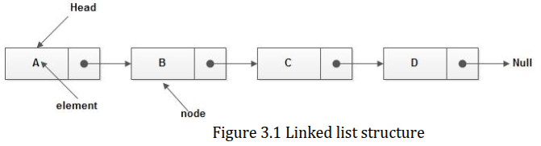

## What is Linked List?

> - `Linked List` contains of a sequence of nodes, joined by links.

> - Each node contains a single element, together with links to one or  
    both neighboring nodes.

| Linked List Structure |
| --------------------- |
|  |

 

> - A `linked list`, in its simplest form, is a collection of `nodes`  
    that together form a linear ordering.

> - A `linked list`, can contain any type of data, strings, characters,  
    and numeric. The elements can be sorted or unsorted.

> - A `node successor` is the next node in the sequence, and its predecessor  
    is the previous node in the sequence. The last node in the sequence has  
    no successor, and the first node in the sequence has no predecessor.

> - A `null link` is used wherever there is no node to link to. Thus every  
    node in a linked list contains a link to its successor, but the last  
    node contains a null link instead.

> - A `length` of a linked list is the number of nodes (elements) in it. A  
    linked list is empty if it has length of zero.

> - We can access the element in any node, provided that we have a link to  
    that node.

> - We can manipulate the links. This makes it possible to achieve a variety  
    of effects. We can insert and delete nodes, thus varying the linked list  
    length dynamically. We can change the order of the nodes. In fact, we can  
    make arbitrary changes to a linked list structure simply by manipulating  
    the links.

> - In linked lists we have a choice between linking each node to one or both  
    of its immediate neighbors.

| Two Different Data Structures to Study |
| -------------------------------------- |
| (1) Singly-linked Lists (SLLs) |
| (2) Doubly-Linked Lists (DLLs) |
