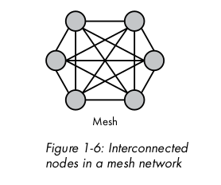

## Topology
> - The organization of nodes in a network.

> - A network's topology can be as simple as a single connection between two nodes or as
    complex as a layout of nodes that don't share a direct connection but are
    nonetheless able to exchange data.

> - Six basic categories of Topology: `point-to-point`, `daisy chain`, `bus`, `ring`,
    `star`, and `mesh`.

 
 

## Point-to-Point Topology
> - Two nodes share a single connection.

> - This type of network connection is uncommon, though it is useful when direct
    communication is required between two nodes.

 
 

## Daisy Chain Topology
> - A series of point-to-point connections.

> - In the daisy chain, traffic from node C, destined for node F, must traverse nodes
    D and E.

> - Intermediate nodes between an origin node and a destination node  are commonly known
    as `hops`.

 
 

## Bus Topology
> - Bus topology shares a common network link.

> - Wired bus networks, aren't common, but this type of topology drives wireless networks.

> - The nodes on a wired networked see all the traffic and selectively ignore or accept it,
    depending on whether the traffic is intended for them.

> - When node `H` sends traffic to node `L` in the bus diagram below, nodes `I`, `J`, `K`,
    and `M` receive the traffic but ignore it.

> - Only node `L` accepts the data because it's the intended recipient.

> - Although wireless clients can see each other's traffic, traffic is usually encrypted.

 
 

## Ring Topology
> - This topology is used in some fiber-optic network deployments, is a closed loop in
    which data travels in a single direction.

> - In figure below, node `N` could send a message destined for node `R` by way of node `O`,
    `P`, and `Q`.

> - Nodes `O`, `P`, `Q` retransmit the message until it reachers node `R`.

> - If node `P` fails to retransmit the message, it will never reach its destination.

> - Because of this design, the slowest node can limit the speed at which data travels.

> - Assuming traffic travels clockwise and node `Q` is the sloweset, node `Q` slows
    traffic sent from node `O` to node `N`.

> - However, traffic sent from node `N` to node `O` is not limited by node `Q` slow
    speed since that traffic does not travers node `Q`.

 
 

## Star Topology
> - In this topology, a central node has individual point-to-point connections to all other
    nodes.

> - You will likely encounter this network topology in wired networks.

> - The central node below, is often a `network switch`, which is a device that accepts data
    from the origin nodes and retransmits data to the destination nodes, like a postal
    service.

> - Adding nodes is a simple matter of connecting them to the switch.

> - Data can traverse only a single hop within this topology.

 
 

## Mesh Topology
> - Based on the figure below, it has a direct connection to every other node.

> - This topology eliminates single points of failure because the failure of a single node
    doesn't affect traffic between any other nodes on the network.

> - On the other hand, cost and complexity increase as the number of nodes increases, making
    topology untenable for large-scale networks.

> - This is another topology you may encounter only in larger wireless networks.

 
 

## Hybrid Topology
> - You can combine two or more basic topologies.

> - Below figure shows The `star-ring` hybrid network is a series of ring networks connected
    to a central node.

> - Another figure shows a `star-bus` hybrid network is a heirarchical topology formed by the
    combination of bus and star network topologies.

> - Hybrid topologies are meant to improve reliability, scalability, and flexibility by taking
    advantage of each topology's strengths and by limiting the disadvantages of each
    topology's to individual segments.

