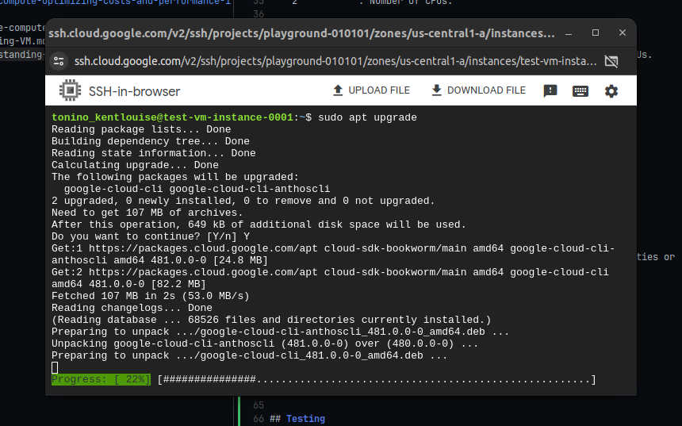

## Compute Engine Family

```plaintext
Different Machine Families
    General Purpose (E2, N2, N2D, N1)
        - Best price-performance ratio.
        - Web and application servers, Small-medium database, Dev environments.

    Memory Optimized (M2, M1)
        - Ultra high memory workloads.
        - Large in-memory databases and In-memory analytics.

    Compute Optimized (C2)
        - Compute intensive workloads.
        - Gaming applications.
```

<br />
<br />


## Compute Engine Machine Types

| Machine Types |
| ------------- |
|  |

<br />

```plaintext
- e2-standard-2
    e2          : Machine type family.
    standard    : Type of workload.
    2           : Number of CPUs.

- Variety of machine types are available for each machine family.

- Memory, disk and networking capabilities increase along with vCPUs.
```

<br />
<br />


## Image

> - What OS and software do you want on the instance?

```plaintext
Type of Images:
    Public Images
        - Provided and maintained by Google or Open Source communities or
          third party vendors.

    Custom Images
        - Created by you for your projects.
```

<br />
<br />


## Testing

> - Click the SSH and authorize to be able to access the terminal.

| VM Instance SSH |
| --------------- |
|  |
