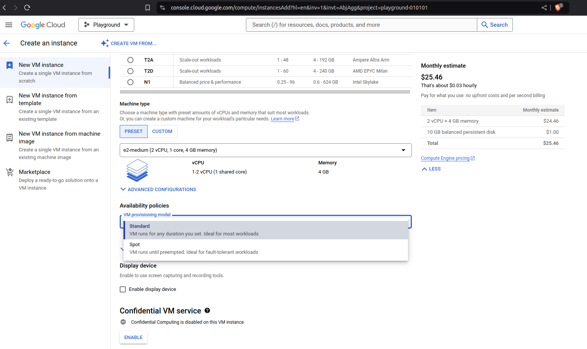

## Spot VM

| Link |
| ---- |
| https://www.udemy.com/course/google-cloud-certification-associate-cloud-engineer/learn/lecture/33630164#overview |

> - Latest version of preemtible VMs.

| Spot VM |
| ------- |
|  |

> - Key difference: Does not have a maximum runtime.

```plaintext
- Traditional VM preemptible VMs have a maximum runtime of 24 hours only.
```

> - Other features similart to traditional premptible VMs.

```plaintext
- May be reclaimed at any time with 30-second notice.
- NOT always available.
- Dynamic Pricing: 60 - 91% discount compared to on-demand VMs.
- Free Tier credits not applicable.
```
