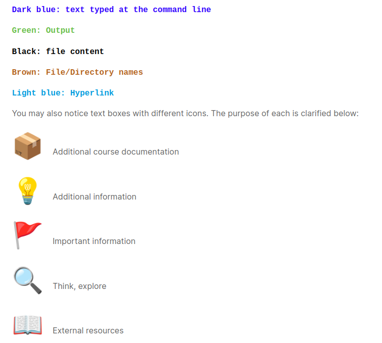

## $\textnormal{Course Formatting}$
> - In order to make it easier to distinguish the various types of content  
    in the course, we use the color coding and formats below.

 

| Course Formmating |
| ----------------- |
|  |
