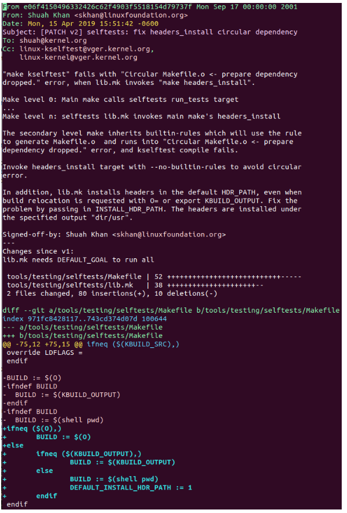

## $\textnormal{The Review Process}$

> - Your patch will get comments from reviewers with  
    suggestions for improvements and, in some cases,  
    learning to know more about the change itself.

> - Please be patient and wait for a minimum of one  
    week before requesting a response.

> - During merge windows and other busy times, it  
    might take longer than a week to get a response.

> - Also, make sure you sent the patch to the right  
    recipients.

> - Please thank the reviewers for their comments and  
    address them.

> - Don’t hesitate to ask a clarifying question if you  
    don’t understand the comment.

> - When you send a new version of your patch, add  
    version history describing the changes made in the  
    new version.

> - The right place for the version history is after  
    the "---" below the Signed-off-by tag and the start  
    of the changed file list, as shown in the screenshot below.

> - Everything between the Signed-off-by and the diff  
    is just for the reviewers, and will not be included  
    in the commit.

> -  Please don’t include version history in the commit log.

| Patch Version History |
| --------------------- |
|  |

 
