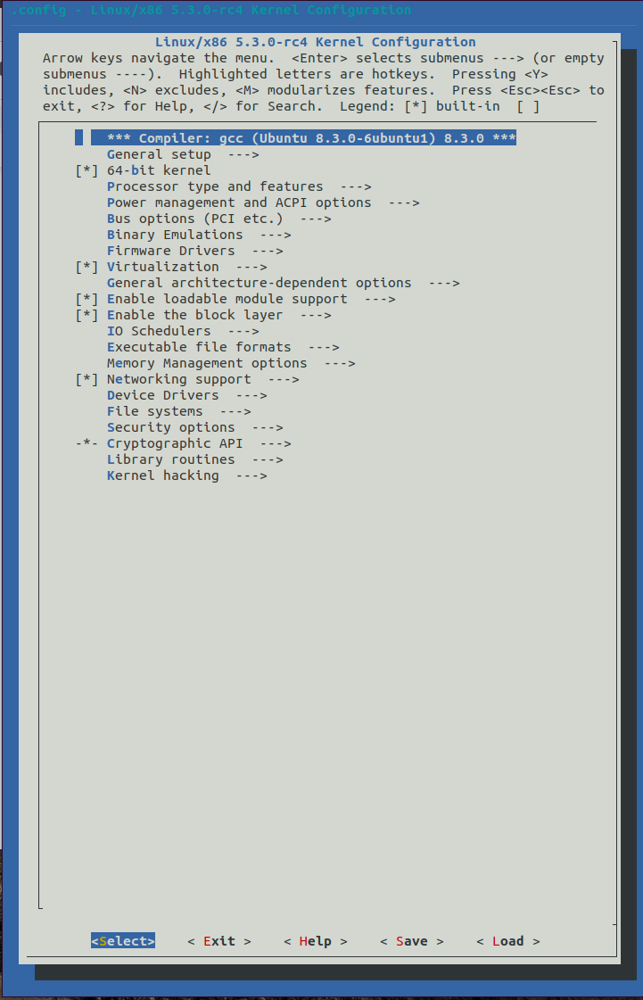
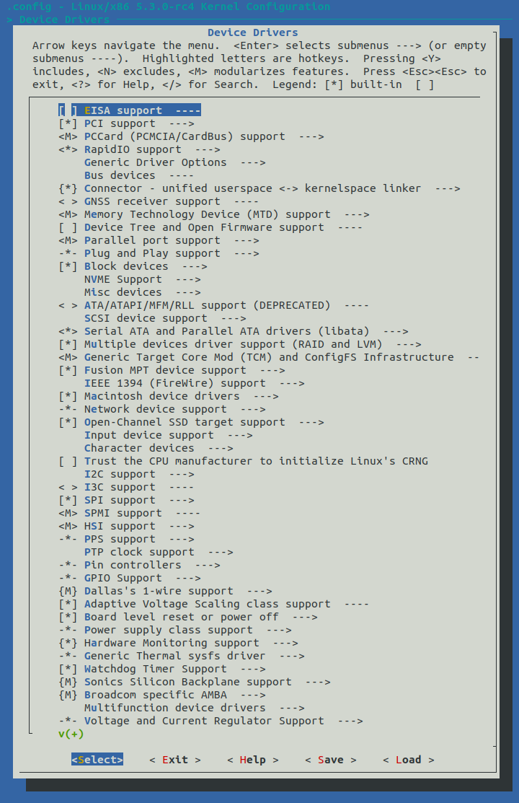
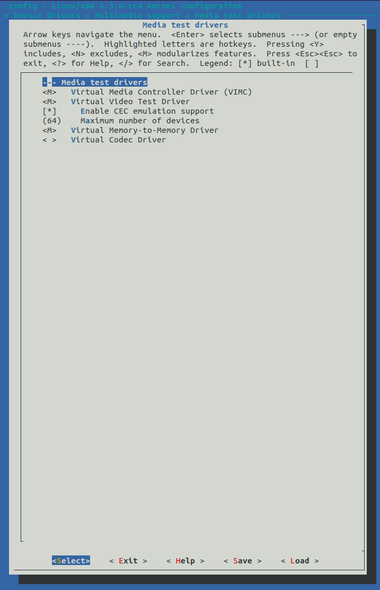

## $\textnormal{Compiling a Module}$

> - Next, let's look at the following variation <br />
    that builds the `vimc` module:

```sh
make M=drivers/media/test-drivers/vimc

# Output.
CC [M] drivers/media/test-drivers/vimc/vimc-core.o
CC [M] drivers/media/test-drivers/vimc/vimc-common.o
CC [M] drivers/media/test-drivers/vimc/vimc-streamer.o
CC [M] drivers/media/test-drivers/vimc/vimc-capture.o
CC [M] drivers/media/test-drivers/vimc/vimc-debayer.o
CC [M] drivers/media/test-drivers/vimc/vimc-scaler.o
CC [M] drivers/media/test-drivers/vimc/vimc-sensor.o
LD [M] drivers/media/test-drivers/vimc/vimc.o
Building modules, stage 2.
MODPOST 1 modules
CC drivers/media/test-drivers/vimc/vimc.mod.o
LD [M] drivers/media/test-drivers/vimc/vimc.ko
```

<br />

> - Sometimes, it is hard to figure out all the <br />
    dependencies for a module, or a driver, or a <br />
    configuration option.

> - Until all the dependencies are enabled, the <br />
    driver you are looking to enable will not be <br />
    enabled.

> - Let’s take a look at `drivers/media/test-drivers/vimc/Kconfig`.

```sh
config VIDEO_VIMC
    tristate "Virtual Media Controller Driver (VIMC)"
    depends on VIDEO_DEV && VIDEO_V4L2 && VIDEO_V4L2_SUBDEV_API
    select VIDEOBUF2_VMALLOC
    select VIDEO_V4L2_TPG
    help
     Skeleton driver for Virtual Media Controller

     This driver can be compared to the vivid driver for emulating
     a media node that exposes a complex media topology. The topology
     is hard coded for now but is meant to be highly configurable in
     the future.

     When in doubt, say N.
```

<br />

> - We can see that vimc can be enabled by changing <br />
    the `CONFIG_VIDEO_VIMC` option.

> - It is a tristate driver.

> - What that means is that it can be:

```plaintext
- enabled as a built-in
- enabled as a module
- disabled.
```

<br />

> - It depends on `CONFIG_VIDEO_DEV`, `CONFIG_VIDEO_V4L2`, and <br />
    `CONFIG_VIDEO_V4L2_SUBDEV_API` to be enabled. It will also <br />
    autoselect `CONFIG_VIDEOBUF2_VMALLOC` and `CONFIG_VIDEO_V4L2_TPG`.

```plaintext
- Enable as a module: CONFIG_VIDEO_VIMC=m
- Enable as built-in: CONFIG_VIDEO_VIMC=y
- Disable: CONFIG_VIDEO_VIMC=n or #CONFIG_VIDEO_VIMC
```

<br />

> - Some options are boolean. That means these modules or options <br />
    can be enabled or disabled. It might take a couple of attempts <br />
    to enable all the dependencies. We recommend using `make menuconfig` <br />
    to enable drivers and other configuration options.

| Kernel Configuration: make menuconfig |
| -------------------- |
|  |

<br />

> - Vimc resides under the `Device Drivers` option.

> - Using the down arrow, you can navigate to the `Device Drivers` <br />
    option and take a look at what there is in there.

> - You can use the "/" option to search.

> - We are showing the long road to give you more details on the <br />
    configuration hierarchy.

| menuconfig Device Drivers |
| ------------------------- |
|  |

<br />

> - Now navigate down until you see `Multimedia support` and then <br />
    follow the `Media test drivers` option.

> - You will see `vimc` there.

| menuconfig vimc |
| --------------- |
|  |

<br />

> - In our configuration, we have it enabled as a module.

> - If you would like to change it, scroll down and this will <br />
    highlight the `M`, at which point you can change it by <br />
    just pressing `Enter`, which will toggle through all three <br />
    options for this driver.

> - That’s enough fun with `menuconfig` for now. We will leave <br />
    it to you to play with other options.
