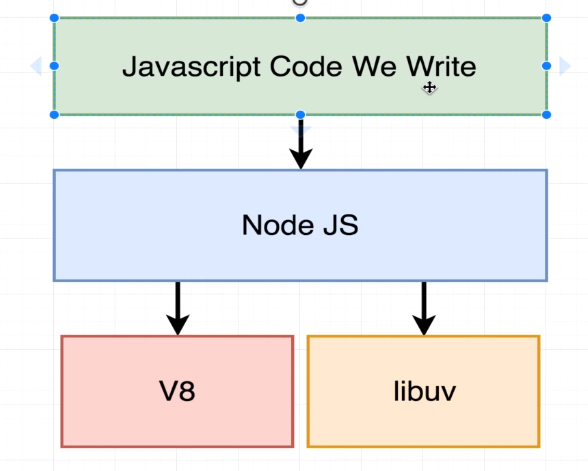
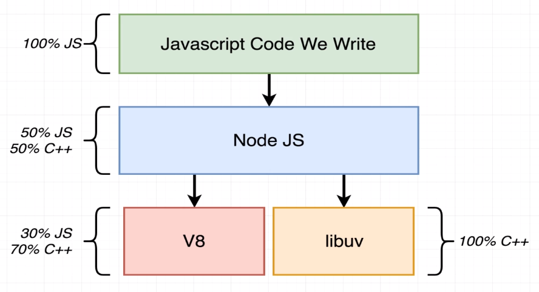
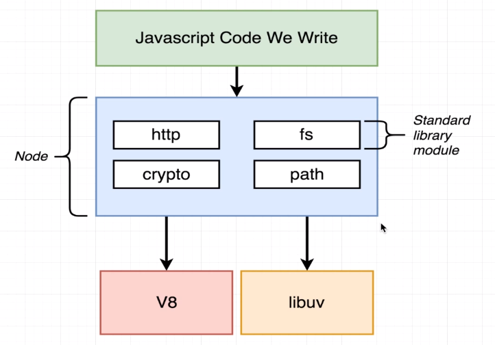

### INTRODUCTION
#

 

 

> - Two most of the dependencies that `Node.js` depends on is `V8` and `libuv`.

> - `V8` is an engine that helps executes JavaScript code outside of the browser.

> - `libuv` is a C++ module that helps Node.js to handle filesystem, networking,
    and other stuff.

 

 

> - `Node.js` acts like a wrapper that unified the `V8` and `libuv` use cases.

 

