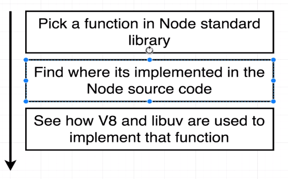
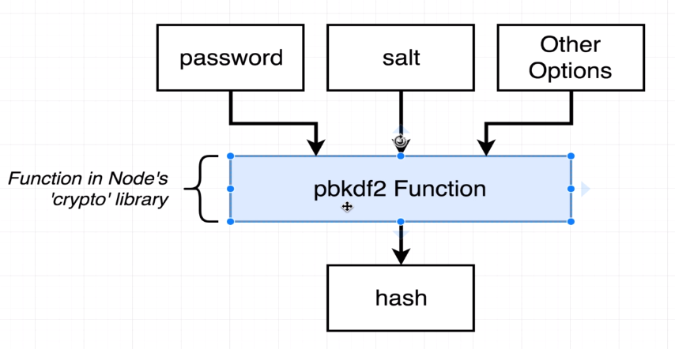
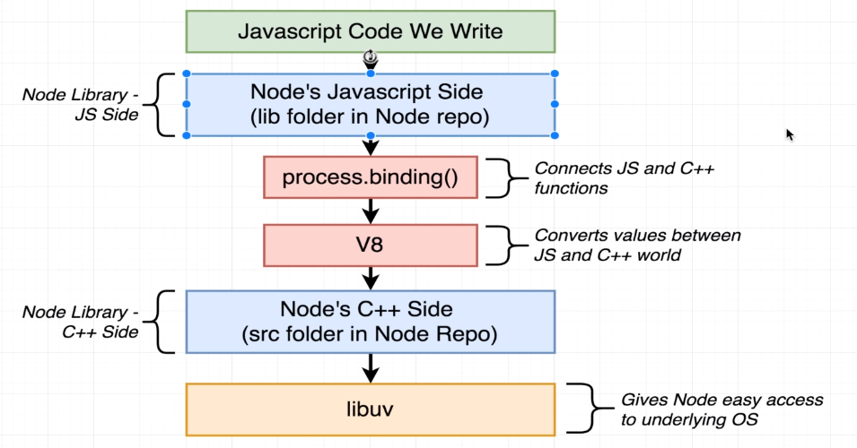

### IMPLEMENTATION
#

<br />



<br />

> - Sample function to use in the video.

<br />



<br />

```plaintext
https://github.com/nodejs/node/blob/main/lib/internal/crypto/pbkdf2.js
```

> - The `node/lib` contains all the javascript definition of modules and functions
    acts as the JavaScript world.

> - The `node/src` directory is the C++ implementations used in Node.js and this
    where the Node.js pull the V8 and libuv.

> - The `process.binding` is how Node.js connects JavaScript with C++ world.

<br />


