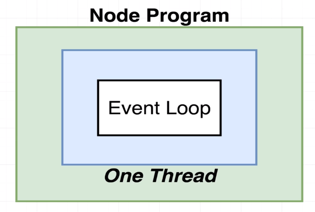

### EVENT LOOP
#

 

 

> - When we start a node program, it automatically creates one thread and then executes all the
    code inside of that one single thread.

> - Inside a single thread there is an `event loop`.

> - `Event loop` is like a control structure that decides what the one thread should be doing
    at any given point in time. This is the absolute core of every Node program that we run and
    every program we run has exactly one event loop.

> - Check the sample program `code-event-loop.js`.
