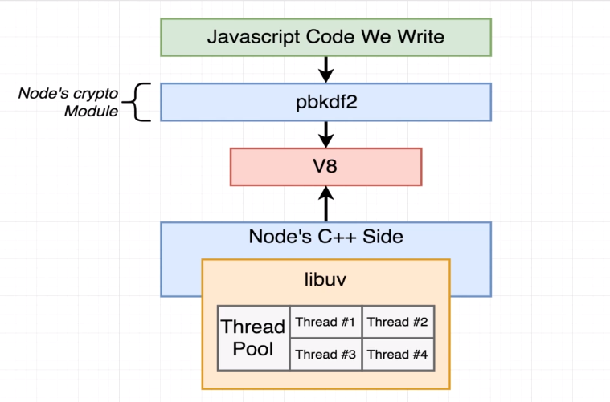
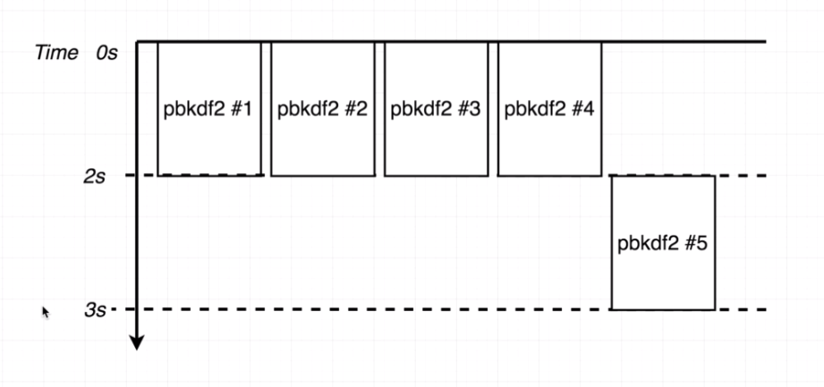
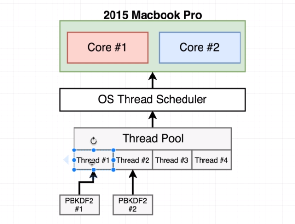

### THREAD POOL WITH MULTI-THREADING
#

 

 

> - This section is based on the `code-thread-2.js` code.

 

 

 

 

> - Based on the example above, the first 4 calls each got assigned to their own
    individual thread. Thread `#1` and `#2` get assigned to `CORE #1`. Then,
    thread `#3` and `#4` get assigned to `Core #2`. The core can only process
    two threads at the same time because of the multi-threading technology in the
    CPU above. However, each core still had to do twice the amount of work at the
    same time.

> - Once the first 4 calls is complete, the 5th thread will get assigned to the
    thread pool.
