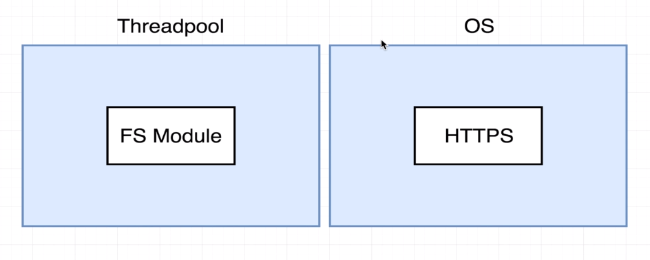

### UNEXPECTED EVENT LOOP EVENTS
#

> - Refer to the `code-multitask.js` file.

 

 

 

> - Filesystem operation are using the `Threadpool` while the
    http request are handled by the operating system.

 

 

 

> - When thread is processing the filesystem request, it will
    reassign its thread to the next thread request, since file
    system might take time to complete.
