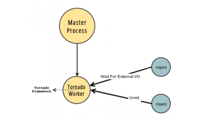

## Server Model

 

| Link |
| ---- |
| https://docs.gunicorn.org/en/latest/design.html#server-model |

 

> - `Gunicorn` is based on the pre-fork worker model.

> - There is a central master process that manages as set of worker  
    processes.

| Master Process with Sync Worker |
| ------------------------------- |
|  |

 

| Master Process with Async Worker |
| -------------------------------- |
|  |

 

| Master Process with Tornado Worker |
| ---------------------------------- |
|  |

 

